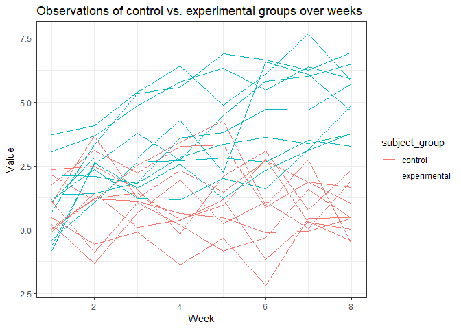
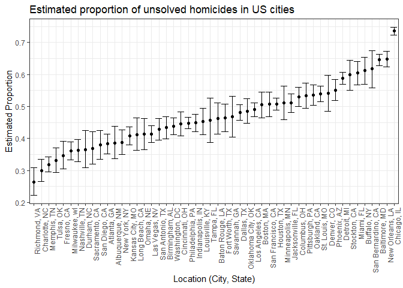

P8105 Homework 5
================

Problem 1: Longitudinal Study
-----------------------------

#### Combine separate files into one dataset

``` r
# Create a dataframe containing file names.
# Input for extracting file data
longstudy_filenames = 
  tibble(subject = list.files("data")) %>% 
  mutate(subject = str_c("./data/", subject))

# Iterate over filenames and read in data into one dataframe
longstudy_df = 
  longstudy_filenames %>% 
  mutate(subject_data = map(.x = subject, ~read_csv(.x))) %>% 
  unnest()
```

#### Clean and tidy dataset

``` r
# Clean and tidy dataset
# Separate filename in subject to only contain subjectID
# Group subjectIDs by individuals administered control or experimental arm
longstudy_df = longstudy_df %>% 
  separate(subject, into = c("remove1", "subjectID"), sep = "a/") %>% 
  separate(subjectID, into = c("subjectID", "remove2"), sep = ".c") %>%
  mutate(subject_ID = subjectID) %>% 
  separate(subjectID, into = c("subject_group", "subject_ID2"), sep = "_") %>% 
  select(subject_group, subject_ID, week_1:week_8) %>% 
  mutate(subject_group = recode(subject_group, 
                                con = "control", 
                                exp = "experimental"))

# Tidy weekly observations by gathering weekly observations
longstudy_df = longstudy_df %>% 
  gather(key = week, value = value, week_1:week_8) %>% 
  separate(week, into = c("remove1", "week"), sep = "_") %>% 
  select(subject_group, subject_ID, week, value) %>% 
  mutate(week = as.numeric(week))
  
longstudy_df
```

    ## # A tibble: 160 x 4
    ##    subject_group subject_ID  week value
    ##    <chr>         <chr>      <dbl> <dbl>
    ##  1 control       con_01         1  0.2 
    ##  2 control       con_02         1  1.13
    ##  3 control       con_03         1  1.77
    ##  4 control       con_04         1  1.04
    ##  5 control       con_05         1  0.47
    ##  6 control       con_06         1  2.37
    ##  7 control       con_07         1  0.03
    ##  8 control       con_08         1 -0.08
    ##  9 control       con_09         1  0.08
    ## 10 control       con_10         1  2.14
    ## # ... with 150 more rows

#### Spaghetti plot: Observations over time

``` r
# Create a spaghetti plot showing observations of each subject over time
longstudy_df %>% 
  ggplot(aes(x = week, y = value, group = subject_ID, color = subject_group)) + 
  geom_line() + 
  labs(
    title = "Observations of control vs. experimental groups over weeks", 
    x = "Week", 
    y = "Value"
  ) + 
  theme_bw()
```



Based off of this plot, the experimental group increases in values over the 8 week period. The control group, on the other hand, does not change much over the 8 week period.

Problem 2: Washington Post Homicide Dataset
-------------------------------------------

#### Load and describe dataset

``` r
# Pull dataset from web and convert it to readable format in R
# Create city_state variable that combines city and state
homicide_df = read_csv(url("https://raw.githubusercontent.com/washingtonpost/data-homicides/master/homicide-data.csv")) %>% 
  unite(city_state, city:state, sep = ", ")
```

The Washington Post homicide dataset contains 52179 observations. Each observation describes an individual homicide case across the United States. There are 11 variables in this dataset. Several of these variable describe the victim of the homicides including their names, age, and other demographic descriptions. For example, 78.08% of victims were male. A table below further describe the race of homicide victims. Other variables describe the location including latitude and longitude. The city and state variables were combined into one variable. This dataset contains information from 51 cities in the US. Finally, the disposition variable describes whether or not the homicide case has been left open or close and whether these cases ended with or without an arrest.

``` r
# Summarize proportions of victim race
homicide_df %>% 
  group_by(victim_race) %>% 
  summarize(n = n()) %>% 
  mutate(proportion = round(n / nrow(homicide_df), digits = 4)) %>% 
  knitr::kable()
```

| victim\_race |      n|  proportion|
|:-------------|------:|-----------:|
| Asian        |    685|      0.0131|
| Black        |  33361|      0.6394|
| Hispanic     |   6901|      0.1323|
| Other        |    700|      0.0134|
| Unknown      |   4199|      0.0805|
| White        |   6333|      0.1214|

``` r
# Summarize proportions of dispositions
homicide_df %>% 
  group_by(disposition) %>% 
  summarize(n = n()) %>% 
  mutate(proportion = round(n / nrow(homicide_df), digits = 4)) %>% 
  knitr::kable()
```

| disposition           |      n|  proportion|
|:----------------------|------:|-----------:|
| Closed by arrest      |  25674|       0.492|
| Closed without arrest |   2922|       0.056|
| Open/No arrest        |  23583|       0.452|

#### Summarize the total number of homicides and unsolved homicides by city.

``` r
# Summarize total number of homicides by city
total_hom = homicide_df %>% 
  group_by(city_state) %>% 
  summarize(total_homicides = n())

# Summarize total number of unsolved homicides by city
unsolved_hom = homicide_df %>% 
  filter(disposition %in% c("Closed without arrest", "Open/No arrest")) %>% 
  group_by(city_state) %>% 
  summarize(unsolved_homicides = n())

homicide_count = inner_join(total_hom, unsolved_hom, by = "city_state")
homicide_count
```

    ## # A tibble: 50 x 3
    ##    city_state      total_homicides unsolved_homicides
    ##    <chr>                     <int>              <int>
    ##  1 Albuquerque, NM             378                146
    ##  2 Atlanta, GA                 973                373
    ##  3 Baltimore, MD              2827               1825
    ##  4 Baton Rouge, LA             424                196
    ##  5 Birmingham, AL              800                347
    ##  6 Boston, MA                  614                310
    ##  7 Buffalo, NY                 521                319
    ##  8 Charlotte, NC               687                206
    ##  9 Chicago, IL                5535               4073
    ## 10 Cincinnati, OH              694                309
    ## # ... with 40 more rows

#### Perform prop.test on Baltimore, MD homicide counts

``` r
# Filter homocide_count dataset to only include Baltimore, MD
sample = 
  homicide_count %>% 
  filter(city_state == "Baltimore, MD")

# Perform proportion test on Baltimore, MD
prop.test(sample$unsolved_homicides, sample$total_homicides) %>% 
  broom::tidy() %>% 
  select(estimate, conf.low, conf.high)
```

    ## # A tibble: 1 x 3
    ##   estimate conf.low conf.high
    ##      <dbl>    <dbl>     <dbl>
    ## 1    0.646    0.628     0.663

#### Create proportion test function

``` r
prop_test = function(unsolved_homicides, total_homicides){
  
  prop = prop.test(unsolved_homicides, total_homicides)
  
  broom::tidy(prop) %>% 
    select(estimate, conf.low, conf.high)
}
```

#### Apply prop.test across each US city

``` r
homicide_count = homicide_count %>% 
  mutate(homicide_prop = 
  map2(.x = homicide_count$unsolved_homicides, .y = homicide_count$total_homicides, 
      ~prop_test(.x, .y))) %>% 
  unnest()
```

#### Plot estimated proportions of unsolved homicides in each US city

``` r
homicide_count %>% 
  mutate(city_state = fct_reorder(city_state, estimate)) %>% 
  ggplot(aes(x = city_state, y = estimate)) + 
  geom_point() + 
  geom_errorbar(aes(ymin = conf.low, ymax = conf.high)) + 
  labs(
    title = "Estimated proportion of unsolved homicides in US cities",
    x = "Location (City, State)",
    y = "Estimated Proportion"
  ) + 
  theme_bw() + 
  theme(axis.text.x = element_text(angle = 90, hjust = 1))
```


